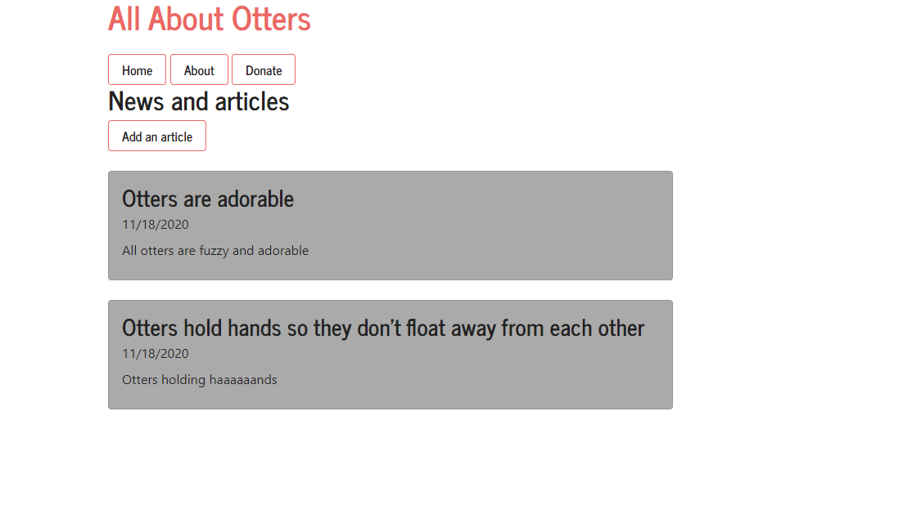

# How to open this project

Use git clone and the link provided in this repo.
Be sure to run npm i to get all releveant packages and dependencies.

# About the project

A simple site created using Node.js, Express, ejs templates and Bootstrap for styling. The Bootstrap is a modified Bootswatch version called 'Journal'

#This is primarily a front-end project and in its current form you can move between pages and explore the content. I hope to add basic saving functionality without getting into databases. The main goal of this project was to get used to the structure of a Node-based project. I hope it helps anyone else still learning~
